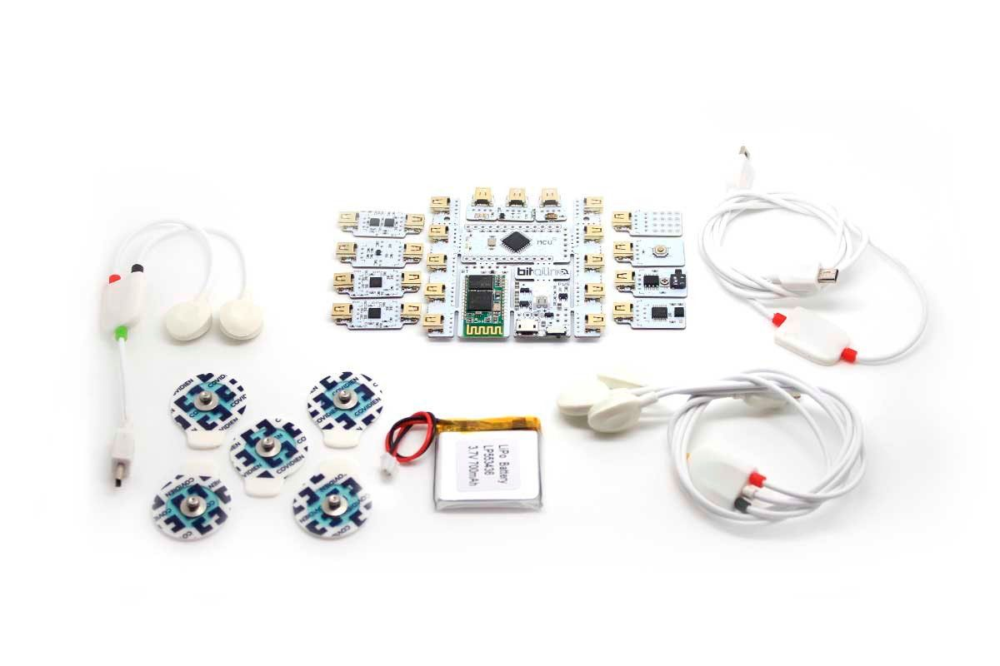
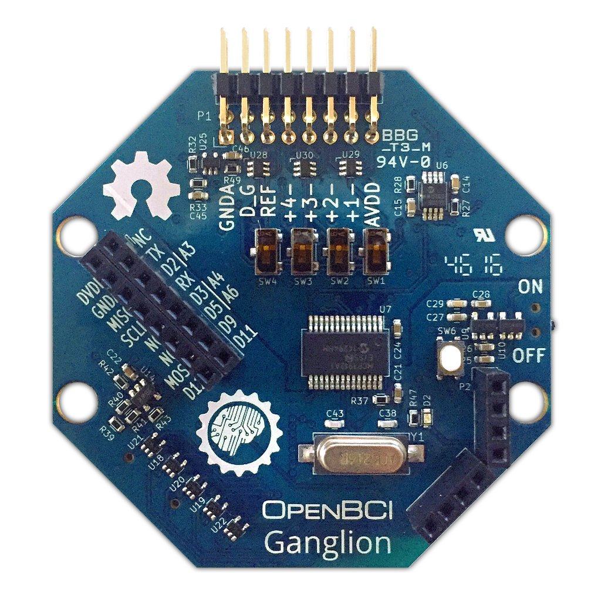
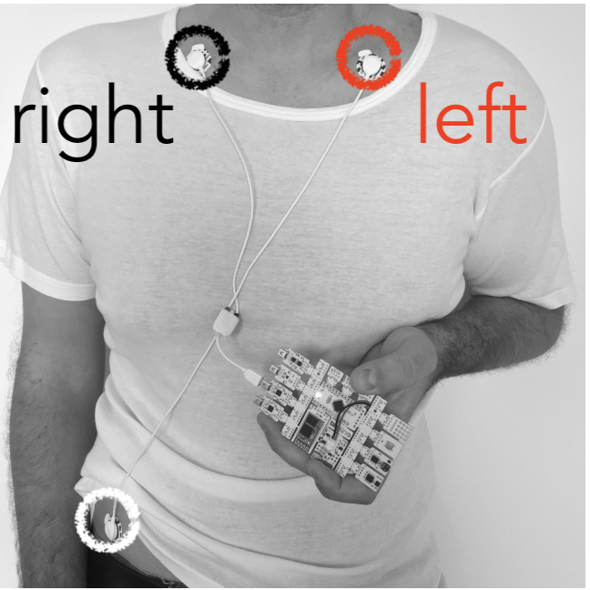
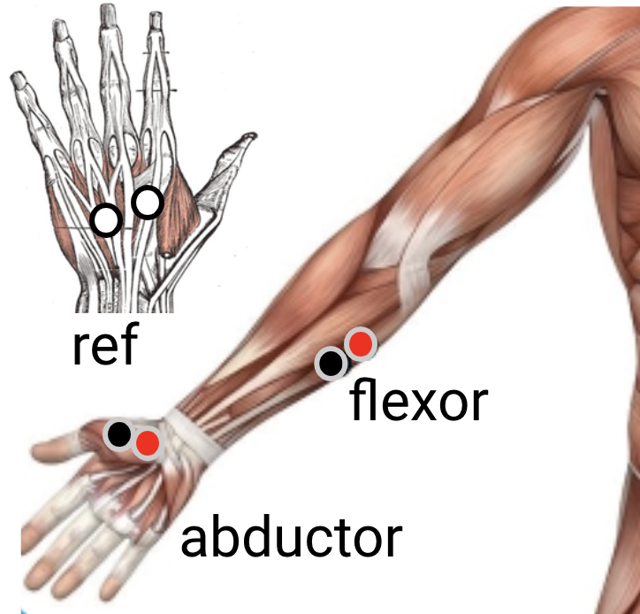
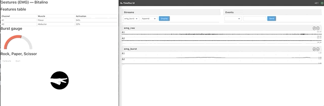
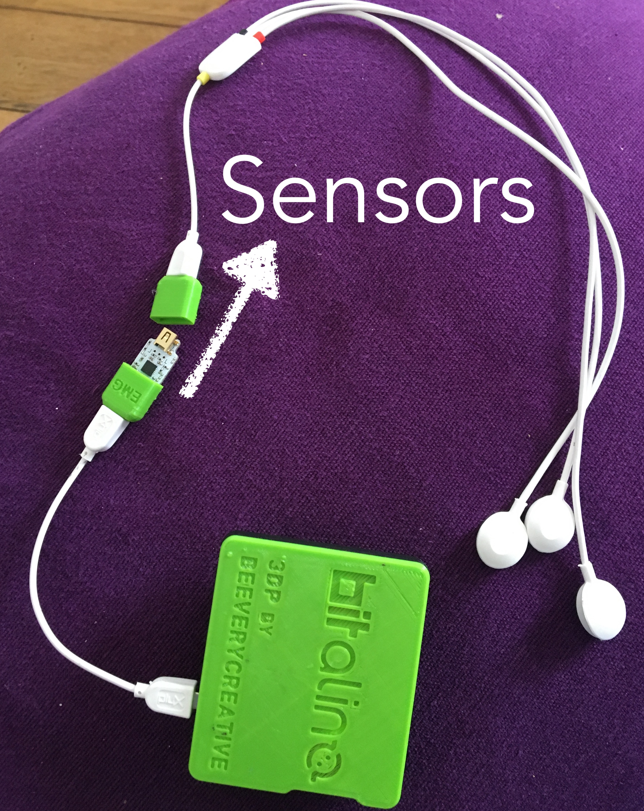

# Hack yourself! 
## Timeflux @ 42
[Timeflux](https://timeflux.io) is an open-source Python framework for building BCI

The event will take place at 42, on March 13-15. It will be preceded by one full day of
basic neurophysiological / BCI theory and by a Timeflux practical workshop on February 26.


Thanks to everybody for making this event possible:

- [Bitalino](https://www.mbed.com/en/) for sponsoring the biosignal (ECG, EMG, frontal EEG) hardware, 
- [OpenBCI](https://openbci.com/) for sponsoring the EEG boards
- [MindAffect](https://www.mindaffect.nl/) for the EEG headset, the Noise-Tagging demo, and the staff
- [NeurotechX/Coglab](https://neurotechx.com/) for the talks and staff  
- [Talent.io](https://www.talent.io/fr/) for the prizes
- [Open Mind Innovation](https://lab.omind.me/) for the continuous support
- **[42 School of course](https://www.42.fr/)** (especially Sophie, Benny, Fabienne and Charles) for support, accomodation & co! 


## What should you expect from the hackathon?


Our Theme -- Hack yourself! :

You will discover and explore real-time processing, biofeedback and brain-computer interfaces. 
You have 48 hours, in a team of five, to developp an application/experiment/installation (whatever :) ) that somehow makes use of bio/neuro-signals 


Choose your track amongst the followings:

1. Occipital (EEG) — MindAffect + OpenBCI
2. Frontal (EEG) — Bitalino
3. Cardiac (ECG) — Bitalino
4. Gestures (EMG) — Bitalino

## Organization 
### Hack your mind and body

- **Team up**
- Select the **input** (brain, heart, muscle)
- We provide **plug-and-play** processing **pipelines** (but you can make your own if you feel adventurous)
- **Connect** everything (0MQ, Websockets, OSC, LSL)
- Build the **output** (Python, JavaScript, Unity, Arduino, other)
- Have **fun**!

### Submissions & Prize Jury

Coming soon :) 

------

# Let's go !
## Installation

Follow the guidelines from this [Getting started](https://doc.timeflux.io/latest/usage/getting_started.html). 

Once you have everything ready (git, anaconda and timeflux installed), you may clone this repository:  
```
git clone https://github.com/timeflux/hackathon
```

- If you still need to install a timeflux conda environment: 

```bash
cd hackathon
conda env create -f environment.yml
conda activate timeflux-hackathon
```

## Repository structure
In this repository, you'll find everything you need to follow the masterclass and to start the hackathon project. 

### App
App is structured 'by tracks', ie. for each folder of the repository, you'll find a subfolder corresponing to one track. 
 
### Data
Here, you'll find HDF5 files to replay and eventually, you'll store your own data there as well. 

### Exercises
Here, you'll find the material for the Masterclass exercises: 

- [Exercise 1](exercises/Exercise 1 - Your very first graph.md): Run your very first graph with timeflux
- [Exercise 2](exercises/Exercise 2 - Playing with waves .md): Edit a YAML graph, play-around with sinus and learn more advance features step by step: 
	1. Learn to use multiple ports 
	2. Practice basic filtering with dsp pluggin
	3. Display your signal in the UI
	4. Save your data into a file and understand ZMQ purpose for multiple graph
	5. Design a feedback with timeflux.js
	6. (bonus) Play around with the parameters to avoid pitfalls. 


### Graphs
- the main graph are named by tracks and imports some graph located in `graphs/subgraph` directory
- `subgraphs` folder is structured 'by tracks', ie. for each folder of the repository, you'll find subfolder corresponing to one track.
	
### Modules
When developping your own application, you often need to design custom nodes for your specific needs. 
See how its done [here](https://github.com/timeflux/timeflux_example/blob/master/timeflux_example/nodes/arithmetic.py) with a very simple node that adds a value to your data. 

This folder is a Python Pacquage containing usefull nodes for these exemple applications. Some of them (if used by more than 2/3 applications) will 
then be integrated to timeflux pluggins. 

## Hackathon
### Hardware
- Bitalino: for tracks #2 ([eeg sensors](https://bitalino.com/datasheets/REVOLUTION_EEG_Sensor_Datasheet.pdf)), #3 ([ecg sensors](https://bitalino.com/datasheets/REVOLUTION_ECG_Sensor_Datasheet.pdf)), #4. ([emg sensors](https://bitalino.com/datasheets/REVOLUTION_EMG_Sensor_Datasheet.pdf)). 

 
 
**NB:** There's a *direction* for plugging in the sensor. 

**NBB:** The sensor are bipolar, that is you have 3 electrodes: ground (white), IN- (black), IN+(red). 

- OpenBCI + MindAffect: for track #1 

 


### Tracks
#### Occipital EEG (Noise tagging) — MindAffect + OpenBCI
#### Pitch
*"With this solution, one wears a headset that measures electrical brain activity. Through visually directing one’s attention at specifically designed stimulus, the BCI matches the brain signals with the stimulus."*

#### Demo 


See other demo in [this video](https://www.kickstarter.com/projects/bci/make-100-create-your-own-brain-computer-interface). 

#### Fontal EEG — Bitalino
##### Sensor montage

You need to plug the EEG sensor at input A1 of Bitalino and place the IN+ and IN- electrodes (black and red) on your forehead and the mass on the bone behind your ear, as follow:


#### Pitch
*"Make your drone fly and land just by looking up and down, communicate through blink-morse or focus and listen to your inner music played by your brain waves. There are so many things we can achieve with a simple sensor on the forehead!"*

#### Demo 

```bash
	conda activate timeflux-hackathon
	timeflux -d graphs/eeg_frontal.yaml
```
Then, open <http://localhost:8000/eeg_frontal/>. 


#### Cardiac (ECG) — Bitalino
##### Sensor montage
You need to plug the ECG at inpuut A1 of Bitalino and place the electrode as follow: 

 
 
/!\ If you revert the IN+ (red) and IN-(black) electrodes, the ECG QRS will be inverted and the cardiac peaks won't be estimated correctly.   

#### Pitch
*"Learn to control this circle biofeedback and create a coherent state in about a minute. Using your respiration to balance your heart, thoughts and emotions, you can achieve energy, inner harmony and feel better fast anywhere. "*
#### Demo 

```bash
	conda activate timeflux-hackathon
	timeflux -d graphs/ecg_cardiac.yaml
```

Then, open <http://localhost:8000/ecg_cardiac/>. 


#### Gestures (EMG) — Bitalino
##### Sensor montage

You need to plug the EMG sensors at input A1 and A2 of Bitalino and place the electrodes as follow: 

 
 
#### Pitch
*" Play Rock, Paper, Scissor on your computer without touching a mouse or a keyboard. 
Here is a new kind of man-machine interface, which has never brought us closer to the spirit of the film Minority Report..."*

```bash
	conda activate timeflux-hackathon
	timeflux -d graphs/emg_gesture.yaml
```

Then, open <http://localhost:8000/emg_gesture/>. 

#### Demo 



# Getting help 
## Community
- [Timeflux slack](https://timeflux.slack.com/join/shared_invite/enQtNjM1MDA1MTI1MTU1LWFjNGQxYmY0ZDgxMDI5MWU3ZDE2ZDMyYjBiNGNjMGZmNmNkNDAzNjM0NmE0MDY3ZWM3MGIzZTFiZjA5ZDNmYjM)
- [NeurotechX slack](https://neurotechx.com/slack/) 
- Or email us a name@imeflux.io with name being pierre, raphaelle, sylvain, .. (depending on your needs !) 

## Helpful Links
- To have a better understanding of digial signal processing, [Raphael Vallat website](https://raphaelvallat.com/) is very nice.
- List of BCI-related ressource by NTX [here](https://github.com/NeuroTechX/awesome-bci)
- In [Neurotechedu](http://learn.neurotechedu.com/lessons/), you will find our educational content grouped by related clusters
- Timefluw documentation [here](https://doc.timeflux.io/latest/)

## Pitffalls
### Timeflux 


#### Check your graphs! 

| Subject        | Symptoms      | Possible answer  |
| -------------- |:-------------:| ----------------:|
| terminal: env  | `command not found: timeflux` | `source activate timeflux`  |
| network: ZMQ   |  multiple graphs cannot communicate      |   You need Pub, Sub AND broker. |
| network: LSL   | stream received through LSL live in a different age      |  Check parameter [`sync`](https://doc.timeflux.io/latest/api/timeflux.nodes.lsl.html) |
| scheduler lags |         |    Increase the rate of your graph (default is 1 refresh per sec) |
| UI routes        | You cannot find your app in the browser    |   You need to launch the timeflux command from where the route to your app is refered in your graph.   |
| subject        | symptoms    |    Possible answer  |
| subject        | symptoms    |    Possible answer  |
| subject        | symptoms    |    Possible answer  |


### Signals processing: 
**Check I/O does what you think!**

command not found: timeflux

- **High filter order and induced delay & phase distortions:**
 IIRFilter is a nonlinear phase filter (in passband), it distorts the frequency contents of passband region of signal. Get convinced yourself with [bonus part of exercise 2.](exercises/Exercise 2 - Playing with waves .md). 
 
 

 
- **Windowing** (the slower, the smoother): Real time is a lie, we do **pseudo-real-time**. Indeed,  Machine learning pipelines usually require the extraction of features that have the ability to represent each class in a representative way in order to be possible to distinguish them. For example, we can use windows of 1 second with or without overlap and represent each of these windows by a set of features, such as the mean, standard deviation, among others. We achieve this by using the [Window](https://doc.timeflux.io/latest/api/timeflux.nodes.window.html) node of timeflux. There are two ways of managing windowed extraction: 
	- **either** you add a node `Window` in your graph and plug it between your signal and your feature extractor (see [welch example](https://github.com/timeflux/hackathon/blob/f15f5582d08d85be30e4365a8200c429984ff2dd/graphs/ecg_coherence/biomarkers.yaml#L156-L163)); 
	- **or** you extend the class `Window` and exploit the output (see [moving average example](https://github.com/timeflux/hackathon/blob/f15f5582d08d85be30e4365a8200c429984ff2dd/modules/nodes/filters.py#L7-L45)). 


 

### Device installation 
**Always have a look at the monitor!**

- Unplug your laptop ! ! 

- Ensure you that sensors are plugged the right way 

 
- Signal quality: always keep a SQI tracker
- Sensors montage: ask google! 

### Commands 
**Keep safeguards!(!!)**

- [False positive](https://en.wikipedia.org/wiki/False_positives_and_false_negatives) **always happen** and can cause damage if you don't keep safeguards in your design. 

 


Imagine you associate a brain state to a command of a drone, it could scratch for example brain because you blinked and the model mistakes. A nice practice is to ask yourself: *how bad is it to classify wrong?*
When you work with more than 2 class, you may look at [confusion matrix](https://en.wikipedia.org/wiki/Confusion_matrix) that represents pairwised false positives. 

- **Dynamic of the feedback** (one more word) should work together with the dynamic of the command. Often, you'll have to choose the length of a rolling window to estimate your markers. In general, if you want to give the user the feeling of control over the interface, the dynamic should be "_as fast as possible_' (ie. short window). It's all a compromise betweeen responsivness (dynamic) and robustness (accuracy). 


- For continuous feedback **the Value range** of the feedback is important as well. Indeed, your feedback needs to know the boundaries of the markers it represents, to be able to gradually adapt the feedback (eg. color, sound, circle radius...). One trick is to use a baseline: either fixed or adaptive, to calibrate the min/max values. Then, to make sure the feedback won't saturate (safeguard again!!) or to go from a continuous feedback to a discrete one, you may use an [activation function](https://en.wikipedia.org/wiki/Activation_function#Comparison_of_activation_functions). 
