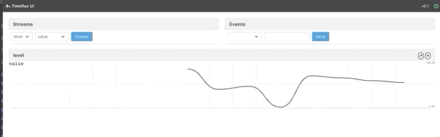
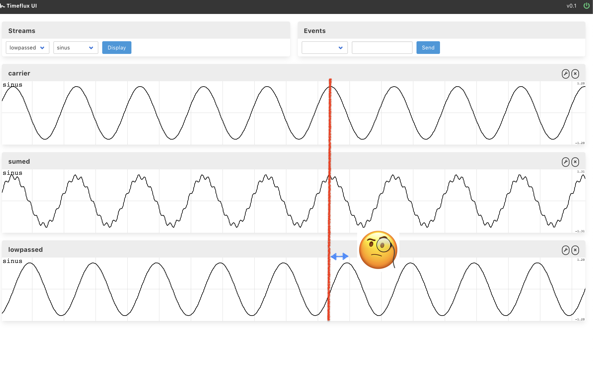
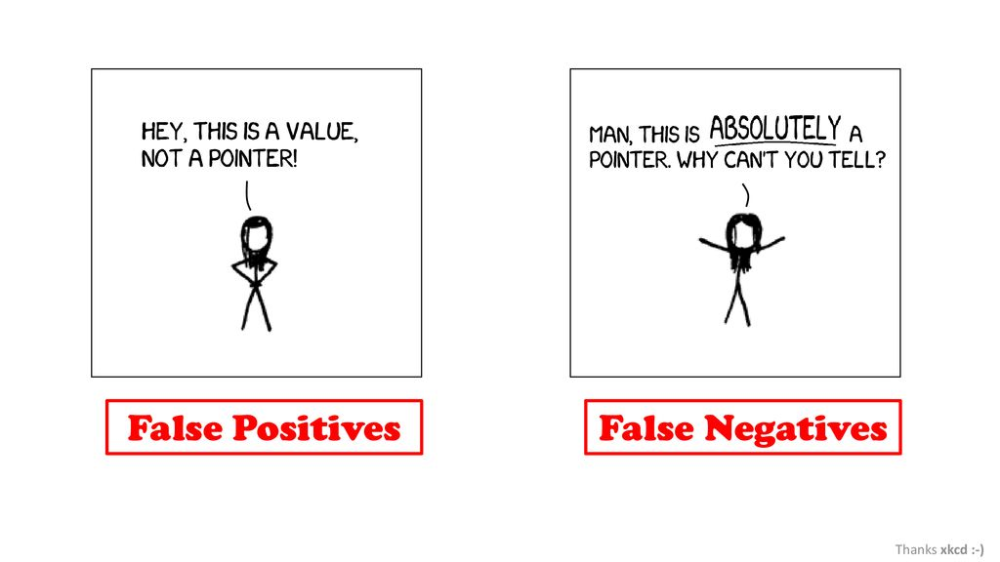
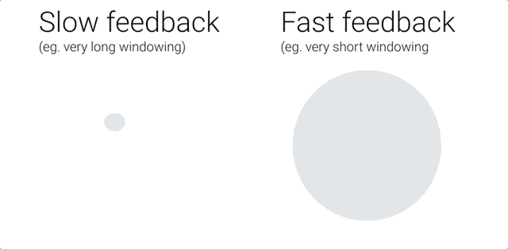

# Hack yourself! 
## Timeflux @ 42
[Timeflux](https://timeflux.io) is an open-source Python framework for building BCI

The event will take place at 42, on March 13-15. It will be preceded by one full day of
basic neurophysiological / BCI theory and by a Timeflux practical workshop on February 26.


Thanks to everybody for making this event possible:

- [Bitalino](https://www.mbed.com/en/) for sponsoring the biosignal (ECG, EMG, frontal EEG) hardware, 
- [OpenBCI](https://openbci.com/) for sponsoring the EEG boards
- [MindAffect](https://www.mindaffect.nl/) for the EEG headset, the Noise-Tagging demo, and the staff
- [NeurotechX/Coglab](https://neurotechx.com/) for the talks and staff  
- [Talent.io](https://www.talent.io/fr/) for the prizes
- [Open Mind Innovation](https://lab.omind.me/) for the continuous support
- **[42 School of course](https://www.42.fr/)** (especially Sophie, Benny and Fabienne) for support, accomodation & co! 


## What should you expect from the hackathon?


Our Theme -- Hack yourself! :

You will discover and explore real-time processing, biofeedback and brain-computer interfaces. 
You have 48 hours, in a team of five, to developp an application/experiment/installation (whatever :) ) that somehow makes use of bio/neuro-signals 


Choose your track amongst the followings:

- Noise tagging BCI (occiptal) — MindAffect + OpenBCI
- Neurofeedback (pre-frontal, bipolar) — Bitalino
- Cardiac coherence (ECG, PPG) — Bitalino
- Gestures (EMG) — Bitalino

## Organization 
### Teams inscriptions
- Team of 5
- Choose a track
- Name the person responsible
- Fullfill the table -> 
- todo ??? 

### Submissions & Prize Jury
todo ! 

How to sign up for the prizes:

- one or more photos/screenshots/videos of your project;
- one paragraph describing your solution;
- submission deadline is Sunday the 15th at 6pm (??)
- todo ??? 

------

# Let's go !
## Installation

Follow the guidelines from this [Getting started](https://doc.timeflux.io/latest/usage/getting_started.html). 

Once you have everything ready (git, anaconda and timeflux installed), you may clone this repository:  
```
git clone https://github.com/timeflux/hackathon
```

## Repository organization
In this repo
### App
### Data
### Exercises
### Graphs
### Modules

## Hackathon
### Hardware

### Tracks
#### Noise tagging BCI (occiptal) — MindAffect + OpenBCI

#### Neurofeedback (pre-frontal, bipolar) — Bitalino

#### Cardiac coherence (ECG, PPG) — Bitalino

#### Gestures (EMG) — Bitalino

------

# Getting help 
## Community
- [Timeflux slack](https://timeflux.slack.com/join/shared_invite/enQtNjM1MDA1MTI1MTU1LWFjNGQxYmY0ZDgxMDI5MWU3ZDE2ZDMyYjBiNGNjMGZmNmNkNDAzNjM0NmE0MDY3ZWM3MGIzZTFiZjA5ZDNmYjM)
- [NeurotechX slack](https://neurotechx.com/slack/) 
- Or email us a name@imeflux.io with name being pierre, raphaelle, sylvain, .. (depending on your needs !) 

## Helpful Links
- To have a better understanding of digial signal processing, [Raphael Vallat website](https://raphaelvallat.com/) is very nice.
- List of BCI-related ressource by NTX [here](https://github.com/NeuroTechX/awesome-bci)
- In [Neurotechedu](http://learn.neurotechedu.com/lessons/), you will find our educational content grouped by related clusters
- Timefluw documentation [here](https://doc.timeflux.io/latest/)

## Piffalls
###Timeflux 


#### Check your graphs! 

| Subject        | Symptoms      | Possible answer  |
| -------------- |:-------------:| ----------------:|
| terminal: env  | `command not found: timeflux` | `source activate timeflux`  |
| network: ZMQ   |  multiple graphs cannot communicate      |   You need Pub, Sub AND broker. |
| network: LSL   | stream received through LSL live in a different age      |  Check parameter [`sync`](https://doc.timeflux.io/latest/api/timeflux.nodes.lsl.html) |
| scheduler lags |         |    Increase the rate of your graph (default is 1 refresh per sec) |
| UI routes        | You cannot find your app in the browser    |   You need to launch the timeflux command from where the route to your app is refered in your graph.   |
| subject        | symptoms    |    Possible answer  |
| subject        | symptoms    |    Possible answer  |
| subject        | symptoms    |    Possible answer  |


### Signals processing: 
**Check I/O does what you think!**

command not found: timeflux

- **High filter order and induced delay & phase distortions:**
 IIRFilter is a nonlinear phase filter (in passband), it distorts the frequency contents of passband region of signal. Get convinced yourself with [bonus part of exercise 2.](exercises/Exercise 1 - Your very first graph.md). 
 
 
- **Windowing** (the slower, the smoother): Real time is a lie, we do **pseudo-real-time**. Indeed,  Machine learning pipelines usually require the extraction of features that have the ability to represent each class in a representative way in order to be possible to distinguish them. For example, we can use windows of 1 second with or without overlap and represent each of these windows by a set of features, such as the mean, standard deviation, among others. We achieve this by using the [Window](https://doc.timeflux.io/latest/api/timeflux.nodes.window.html) node of timeflux. There are two ways of managing windowed extraction: 
	- **either** you add a node `Window` in your graph and plug it between your signal and your feature extractor (see [welch example](https://github.com/timeflux/hackathon/blob/f15f5582d08d85be30e4365a8200c429984ff2dd/graphs/ecg_coherence/biomarkers.yaml#L156-L163)); 
	- **or** you extend the class `Window` and exploit the output (see [moving average example](https://github.com/timeflux/hackathon/blob/f15f5582d08d85be30e4365a8200c429984ff2dd/modules/nodes/filters.py#L7-L45)). 


 

### Device installation 
Always have a look at the monitor! 

- Ensure you that sensors are plugged the right way
- Signal quality: always keep a SQI tracker
- Sensors montage: ask google! 

### Commands 
**Keep safeguards!(!!)**

- [False positive](https://en.wikipedia.org/wiki/False_positives_and_false_negatives) **always happen** and can cause damage if you don't keep safeguards in your design. 

Imagine you associate a brain state to a command of a drone, it could scratch for example brain because you blinked and the model mistakes. A nice practice is to ask yourself: *how bad is it to classify wrong?*
When you work with more than 2 class, you may look at [confusion matrix](https://en.wikipedia.org/wiki/Confusion_matrix) that represents pairwised false positives. 

- **Dynamic of the feedback** (one more word) should work together with the dynamic of the command. Often, you'll have to choose the length of a rolling window to estimate your markers. In general, if you want to give the user the feeling of control over the interface, the dynamic should be "_as fast as possible_' (ie. short window). It's all a compromise betweeen responsivness (dynamic) and robustness (accuracy). 


- For continuous feedback **the Value range** of the feedback is important as well. Indeed, your feedback needs to know the boundaries of the markers it represents, to be able to gradually adapt the feedback (eg. color, sound, circle radius...). One trick is to use a baseline: either fixed or adaptive, to calibrate the min/max values. Then, to make sure the feedback won't saturate (safeguard again!!) or to go from a continuous feedback to a discrete one, you may use an [activation function](https://en.wikipedia.org/wiki/Activation_function#Comparison_of_activation_functions). 
