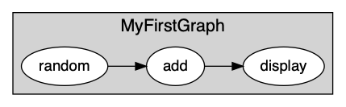
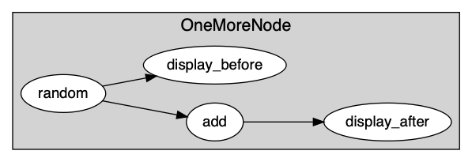
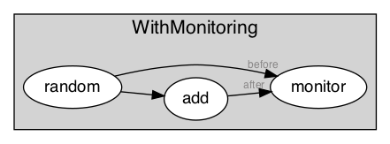

# Exercise 1 - Your very first graph  


## Hello 1
For your first iteration, here is what you will build:  




```yaml
graphs:
  - id: MyFirstGraph
    nodes:
    - id: random
      module: timeflux.nodes.random
      class: Random
      params:
        columns: 5
        rows_min: 1
        rows_max: 10
        value_min: 0
        value_max: 5
        seed: 1
    - id: add
      module: timeflux_example.nodes.arithmetic
      class: Add
      params:
        value: 1
    - id: display
      module: timeflux.nodes.debug
      class: Display
    edges:
    - source: random
      target: add
    - source: add
      target: display
    rate: 1
```

### Run from command line 
In a terminal, activate your timeflux environment

```
conda activate timeflux-hackathon
```

and launch the app in debug (`-d` mode) : 

```
 timeflux -d graphs/hello_world/hello_1.yaml 
```
This will display in your terminal Dataframe with random values at which you added 1. The index of the DataFrame is the time, that is why we call it a 'time-series'.

## Hello 2 
For your second iteration, here is what you will build:  




```yaml
graphs:
  - id: OneMoreNode
    nodes:
    - id: random
      module: timeflux.nodes.random
      class: Random
    - id: add
      module: timeflux_example.nodes.arithmetic
      class: Add
      params:
        value: 1
    - id: display_before
      module: timeflux.nodes.debug
      class: Display
    - id: display_after
      module: timeflux.nodes.debug
      class: Display
    edges:
    - source: random
      target: add
    - source: random
      target: display_before
    - source: add
      target: display_after
```


### Run from command line 
In a terminal, activate your timeflux environment

```
conda activate timeflux-hackathon
```

and launch the app in debug (`-d` mode) : 

```
 timeflux -d graphs/hello_world/hello_2.yaml 
```

This will display in your terminal Dataframe with random values before and after having add 1. See on the graph, you plugged a 'display' node after node random and node add. In your terminal, you'll see two dataframe at each time the scheduler parses the graph, one is the output of random, the other the output of add. Both have the same index (ie. timestamps, time). 


See bellow the kind of display you get:

```

    2020-02-24 16:36:15,053 INFO       timeflux     46996    MainProcess      Timeflux 0.4+28.g2d74dcc.dirty
    2020-02-24 16:36:15,062 DEBUG      manager      46996    MainProcess      Worker spawned with PID 47003
    2020-02-24 16:36:15,402 DEBUG      debug        47003    Process-1        
                                 0  1  2  3  4
    2020-02-24 16:36:14.396442  5  3  4  0  1
    2020-02-24 16:36:14.729775  3  5  0  0  1
    2020-02-24 16:36:15.063108  4  5  4  1  2
    2020-02-24 16:36:15,414 DEBUG      debug        47003    Process-1        
                                 0  1  2  3  4
    2020-02-24 16:36:14.396442  6  4  5  1  2
    2020-02-24 16:36:14.729775  4  6  1  1  2
    2020-02-24 16:36:15.063108  5  6  5  2  3
 
```

- `2020-02-24 16:36:14.396442` is the time 
- there are 5 columns (that could be 5 EEG sensor for example)
- `5  3  4  0  1` is the first row of random values 
- `6  3  4  0  1` is the same row, after hafvig add 1 

It should be notted that of course, the hello world app plays with random data, but the real thing with timeflux is to deal with bioignal and instead of adding 1 to a time-series, it extracts interesting biomarkers. 
                                 
## Hello 3 
For your third iteration, here is what you will build:  



```yaml
graphs:

  - id: Broker
    nodes:
    - id: proxy
      module: timeflux.nodes.zmq
      class: Broker

  - id: Publisher
    nodes:
    - id: random
      module: timeflux.nodes.random
      class: Random
      params:
        columns: 2
        seed: 1
    - id: add
      module: timeflux_example.nodes.arithmetic
      class: Add
      params:
        value: 1
    - id: pub_before
      module: timeflux.nodes.zmq
      class: Pub
      params:
        topic: before
    - id: pub_after
      module: timeflux.nodes.zmq
      class: Pub
      params:
        topic: after
    edges:
    - source: random
      target: add
    - source: random
      target: pub_before
    - source: add
      target: pub_after

  - id: Subscriber
    nodes:
    - id: sub
      module: timeflux.nodes.zmq
      class: Sub
      params:
        topics: [ before, after ]
    - id: monitor
      module: timeflux_ui.nodes.ui
      class: UI
    edges:
      - source: sub:before
        target: monitor:before
      - source: sub:after
        target: monitor:after
```

Here, you use havee multiple graphs, so you need a Broker to exchange data between graphs by subscribing and publishing them. 
There are 3 graphs in this app: Broker, Publisher, Subscriber. 
The Publisher is very similar to the graph from hello_2 where you generate random time-series and add 1. The difference is that you replace the 'display' node by publishers. You won't see any data displayed in your terminal. But you published them in the Broker under topic names 'before' and 'after', and then, see,  the Subriber graph subribes to those topics and sends them to the UI monitoring at ports named 'before' and 'after'. So if you open adress <http://localhost:8000/monitor/> in your broser, you should see thee two timeseries, before and after having add 1. 
To display a signal, you must select a stream and a channel in the dropdown and click in 'display' button. 