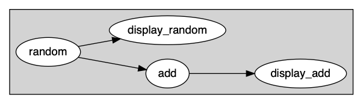

# Exercise 1 - Your very first graph  

For your first iteration, here is what you will build:



## Load the YAML graph 

```yaml
graphs:
  - id: hello_world
    nodes:
    - id: random
      module: timeflux.nodes.random
      class: Random
      params:
        columns: 5
        rows_min: 1
        rows_max: 10
        value_min: 0
        value_max: 5
        seed: 1
    - id: add
      module: timeflux_example.nodes.arithmetic
      class: Add
      params:
        value: 1
    - id: display_random
      module: timeflux.nodes.debug
      class: Display
    - id: display_add
      module: timeflux.nodes.debug
      class: Display
    edges:
    - source: random
      target: add
    - source: random
      target: display_random
    - source: add
      target: display_add
```


# Run from command line 
In a terminal, activate your timeflux environment
```
conda activate timeflux
```
and launch the app in deebug (`-d` mode) : 

```
> timeflux -d graphs/hello_world.yaml 
```

```

    2020-02-24 16:36:15,053 INFO       timeflux     46996    MainProcess      Timeflux 0.4+28.g2d74dcc.dirty
    2020-02-24 16:36:15,062 DEBUG      manager      46996    MainProcess      Worker spawned with PID 47003
    2020-02-24 16:36:15,402 DEBUG      debug        47003    Process-1        
                                 0  1  2  3  4
    2020-02-24 16:36:14.396442  5  3  4  0  1
    2020-02-24 16:36:14.729775  3  5  0  0  1
    2020-02-24 16:36:15.063108  4  5  4  1  2
    2020-02-24 16:36:15,414 DEBUG      debug        47003    Process-1        
                                 0  1  2  3  4
    2020-02-24 16:36:14.396442  6  4  5  1  2
    2020-02-24 16:36:14.729775  4  6  1  1  2
    2020-02-24 16:36:15.063108  5  6  5  2  3
    2020-02-24 16:36:16,404 DEBUG      debug        47003    Process-1        
                                 0  1  2  3  4
    2020-02-24 16:36:15.397038  4  5  2  4  3
    2020-02-24 16:36:15.497038  4  2  4  5  2
    2020-02-24 16:36:15.597038  4  1  1  0  5
    2020-02-24 16:36:15.697038  1  1  5  1  1
    2020-02-24 16:36:15.797038  0  4  1  0  0
    2020-02-24 16:36:15.897038  5  3  2  1  0
    2020-02-24 16:36:15.997038  3  5  1  1  3
    2020-02-24 16:36:16.097038  4  0  1  3  4
    2020-02-24 16:36:16.197038  2  4  0  5  3
    2020-02-24 16:36:16.297038  1  2  0  4  1
    2020-02-24 16:36:16,412 DEBUG      debug        47003    Process-1        
                                 0  1  2  3  4
    2020-02-24 16:36:15.397038  5  6  3  5  4
    2020-02-24 16:36:15.497038  5  3  5  6  3
    2020-02-24 16:36:15.597038  5  2  2  1  6
    2020-02-24 16:36:15.697038  2  2  6  2  2
    2020-02-24 16:36:15.797038  1  5  2  1  1
    2020-02-24 16:36:15.897038  6  4  3  2  1
    2020-02-24 16:36:15.997038  4  6  2  2  4
    2020-02-24 16:36:16.097038  5  1  2  4  5
    2020-02-24 16:36:16.197038  3  5  1  6  4
    2020-02-24 16:36:16.297038  2  3  1  5  2
    2020-02-24 16:36:17,405 DEBUG      debug        47003    Process-1        
                                 0  1  2  3  4
    2020-02-24 16:36:16.397814  2  2  1  0  1
    2020-02-24 16:36:16.897814  3  5  4  3  5
    2020-02-24 16:36:17,412 DEBUG      debug        47003    Process-1        
                                 0  1  2  3  4
    2020-02-24 16:36:16.397814  3  3  2  1  2
    2020-02-24 16:36:16.897814  4  6  5  4  6
    2020-02-24 16:36:18,406 DEBUG      debug        47003    Process-1        
```
                                 


# Use a meta-node to prototype offline

When one is prototyping a pipeline (developping custom nodes, writting a graph, .. ), it is very usefull to be able to loop manually, allowing him to use debug breakpoints, and check that each update of each node produces the result he expects.

Here, we use the concept of [branch](https://doc.timeflux.io/latest/extending/branches.html) to load a graph offline and mimick the scheduler *manually*, by `setting` the input ports and `getting` the output ports. 


```python
from timeflux.core.registry import Registry
Registry.cycle_start = 0
Registry.rate = 1

branch = Branch(graph=graph)
branch.update()

```

    DEBUG:timeflux.timeflux.nodes.debug.Display:
                                 0  1  2  3  4
    1969-12-31 23:59:59.000000  5  3  4  0  1
    1969-12-31 23:59:59.333334  3  5  0  0  1
    1969-12-31 23:59:59.666667  4  5  4  1  2
    INFO:numexpr.utils:Note: NumExpr detected 12 cores but "NUMEXPR_MAX_THREADS" not set, so enforcing safe limit of 8.
    INFO:numexpr.utils:NumExpr defaulting to 8 threads.
    DEBUG:timeflux.timeflux.nodes.debug.Display:
                                 0  1  2  3  4
    1969-12-31 23:59:59.000000  6  4  5  1  2
    1969-12-31 23:59:59.333334  4  6  1  1  2
    1969-12-31 23:59:59.666667  5  6  5  2  3


```python
    branch.get_port('add', port_id='o').data
```

```
                                0	1	2	3	4
    1969-12-31 23:59:59.000000	6	4	5	1	2
    1969-12-31 23:59:59.333334	4	6	1	1	2
    1969-12-31 23:59:59.666667	5	6	5	2	3
```

