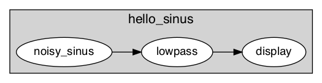
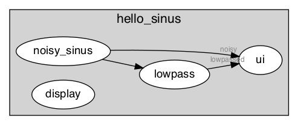

# Exercise 2 - Playing with waves

In this exercise, you are going to build a simple app without any line of code, only by describing your pipeline in the YAML syntax. 
The goal is for you to get acquainted with this syntax. 


## Exercise statement
In this exercise, you will : 

1. generate two sinus waves (this has already been done for you) <br>
2. sum this two signals (this is [Part 1](#part_1))
3. lowpass the summed signal (this is [Part 2](#part_2))
4.  display the signal using the UI monitoring (this is [Part 3](#part_3))
5. save the data in a HDF5 file (this is [Part 4](#part_4))
6. *(bonus) play around with parameters*

## Getting started

In this exercise, you will be editing a YAML graph and run it using timeflux command line. 

First, let's have a look at the graph. 

<div class="highlight"><pre><span></span><span class="nt">graphs</span><span class="p">:</span>
  <span class="p p-Indicator">-</span> <span class="nt">id</span><span class="p">:</span> <span class="l l-Scalar l-Scalar-Plain">hello_sinus</span>
    <span class="nt">nodes</span><span class="p">:</span>
      <span class="p p-Indicator">-</span> <span class="nt">id</span><span class="p">:</span> <span class="l l-Scalar l-Scalar-Plain">carrier_sinus</span>
        <span class="nt">module</span><span class="p">:</span> <span class="l l-Scalar l-Scalar-Plain">timeflux_example.nodes.sinus</span>
        <span class="nt">class</span><span class="p">:</span> <span class="l l-Scalar l-Scalar-Plain">Sinus</span>
        <span class="nt">params</span><span class="p">:</span>
          <span class="nt">rate</span><span class="p">:</span> <span class="l l-Scalar l-Scalar-Plain">.5</span>
          <span class="nt">amplitude</span><span class="p">:</span> <span class="l l-Scalar l-Scalar-Plain">1</span>

      <span class="p p-Indicator">-</span> <span class="nt">id</span><span class="p">:</span> <span class="l l-Scalar l-Scalar-Plain">noise_sinus</span>
        <span class="nt">module</span><span class="p">:</span> <span class="l l-Scalar l-Scalar-Plain">timeflux_example.nodes.sinus</span>
        <span class="nt">class</span><span class="p">:</span> <span class="l l-Scalar l-Scalar-Plain">Sinus</span>
        <span class="nt">params</span><span class="p">:</span>
          <span class="nt">rate</span><span class="p">:</span> <span class="l l-Scalar l-Scalar-Plain">5</span>
          <span class="nt">amplitude</span><span class="p">:</span> <span class="l l-Scalar l-Scalar-Plain">.1</span>

      <span class="p p-Indicator">-</span> <span class="nt">id</span><span class="p">:</span> <span class="l l-Scalar l-Scalar-Plain">display</span>
        <span class="nt">module</span><span class="p">:</span> <span class="l l-Scalar l-Scalar-Plain">timeflux.nodes.debug</span>
        <span class="nt">class</span><span class="p">:</span> <span class="l l-Scalar l-Scalar-Plain">Display</span>

      <span class="c1"># part 1</span>
      <span class="c1"># TODO: add a node that adds the two sinus</span>
      <span class="c1"># Hint:  https://doc.timeflux.io/latest/api/timeflux_example.nodes.arithmetic.html</span>

      <span class="c1"># part 2</span>
      <span class="c1"># TODO: add a lowpass filter to filter the summed signal</span>
      <span class="c1"># Hint: https://doc.timeflux.io/latest/api/timeflux_dsp.nodes.filters.html</span>

      <span class="c1"># part 3</span>
      <span class="c1"># TODO: add an UI to monitor the signal before and after filtering</span>

    <span class="nt">edges</span><span class="p">:</span>
      <span class="p p-Indicator">-</span> <span class="nt">source</span><span class="p">:</span> <span class="l l-Scalar l-Scalar-Plain">carrier_sinus</span>
        <span class="nt">target</span><span class="p">:</span> <span class="l l-Scalar l-Scalar-Plain">display</span>
      <span class="c1">#      - source:</span>
      <span class="c1">#        target:</span>
      <span class="c1">#       part 1: TODO: plug the noise and carrier sinus to the input ports of your summation node</span>


      <span class="c1">#      # part 2</span>
      <span class="c1"># TODO: plug the summed signal to the filter</span>

      <span class="c1"># part 3</span>
      <span class="c1"># TODO: plug the signals to the UI</span>

    <span class="nt">rate</span><span class="p">:</span> <span class="l l-Scalar l-Scalar-Plain">32</span>
</pre></div>


### Command line 
- Open a terminal 
- Activate your environment:  
	```
	conda activate timeflux
	```
- Run the app in debug mode: 
	```
	timeflux -d graphs/hello_worlds/hello_sinus_exercise.yaml	```

## <a href='#part_1'>Part 1</a> : Sum two signals

Sum the carrier and noise wave using the multi input ports.

**Hint:  [Have a look at arithmetic node](https://doc.timeflux.io/latest/api/timeflux_example.nodes.arithmetic.html)**



Answer the TODO of part 1 and again, in a terminal, run:

```
timeflux graphs/hello_sinus_exercise.yaml -d
```

One solution is given [here](../graphs/hello_worlds/hello_sinus_solution_part4.yaml)

## <a href='#part_2'>Part 2</a> : Filter a signal 
Filter the summed signal to retrieve the carrier wave. 

**Hint:** Have a look at [this](https://doc.timeflux.io/latest/api/timeflux_dsp.nodes.filters.html) piece of doc.

Answer the TODO of part 2 and again, in a terminal, run:

```
timeflux graphs/hello_sinus_exercise.yaml -d
```


One solution is given [here](../graphs/hello_worlds/hello_sinus_solution_part2.yaml)




## <a href='#part_3'>Part 3</a> :  Visualize the signals   
Use timeflux UI monitoring to display pre/post signals in your browser.

**Hint:** [Here](https://doc.timeflux.io/latest/api/timeflux_ui.nodes.ui.html) is the doc.

Answer the TODO of part 3 and again, in a terminal, run:

```
timeflux graphs/hello_sinus_exercise.yaml -d
```

You may now open your browser at `http://localhost:8000/monitor/` and monitor your time-series ! 


One solution is given [here](../graphs/hello_worlds/hello_sinus_solution_part3.yaml)


## <a href='#part_4'>Part 4</a> : Save your data in HDF5

Save your data in HDF5. <br>

**Hint:** Check [this](https://doc.timeflux.io/latest/usage/use_case.html) use case!]

<div class="alert alert-info">
Until here, we only had one graph running at 32 Hz. In this part, we want to save the data to a file, which does not have to be done 32 times per seconds, and could lead to congestion. Therefore, it's highly recommanded to run the HDF5 recorder in a separate graph running at a lower rate.
</div>

<span style="color:red">**=> Pitfall #3 don't forget a Broker !!**</span>


In a terminal, run:

```
timeflux graphs/hello_sinus_exercise.yaml -d
```

One solution is given [here](../graphs/hello_worlds/hello_sinus_solution_part4.yaml)


## <a href='#bonus'>Bonus</a> : Play around with the parameters


Now, time to play around with the parameters. 

For example, you may investigate the followin questions: 

### Questions
1.  What happens if you change the order of lowpass filter from 3 to 10? 
2.  What happens if you increase/decrease the rate of the graph? 

### Answers
1.  See bellow. 

IIRFilter is a nonlinear phase filter (in passband), it distorts the frequency contents of passband region of signal.
when working offline, one prefer to use a forward-backward filter ( [filtfilt](https://docs.scipy.org/doc/scipy-0.18.1/reference/generated/scipy.signal.filtfilt.html) ), which is not trivial online (but coming very soon!). 


2.  If you increase (too much) the rate of your graph, you'll notice some 'congestion' warnings in the console, it means that your nodes are still working when the scheduler updates. 
    In you drecrease (too much) the rate of your graph, you'll notice that the time gets late, and that signals kind of stutter. 

